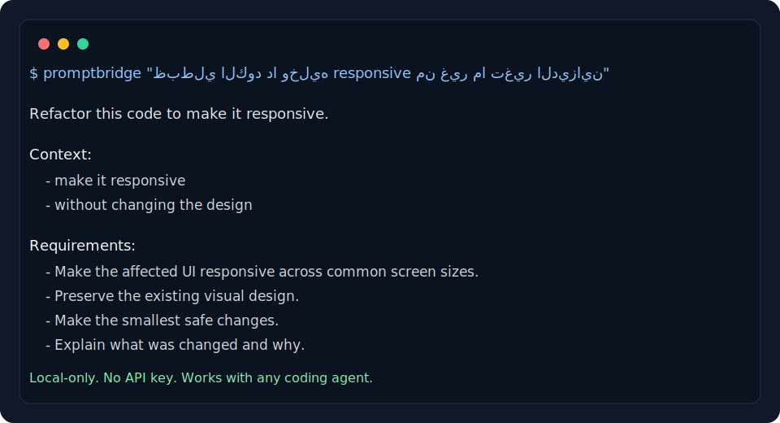

# PromptBridge Arabic

[](https://github.com/ZiadEldesoky/promptbridge-arabic/actions/workflows/ci.yml)
[](https://github.com/ZiadEldesoky/promptbridge-arabic/releases)
[](LICENSE)

Arabic-first prompt translator and optimizer for AI coding agents.

PromptBridge Arabic lets Arabic-speaking developers write coding prompts in Arabic or Egyptian Arabic, then converts them into structured English prompts that work well with Codex, Claude Code, Cursor, Gemini CLI, and other AI developer tools.



The current MVP is intentionally local and deterministic:

- No API key required.
- No AI translation yet.
- No desktop app, browser extension, VS Code extension, or direct agent integration yet.
- CLI-first, clipboard-friendly, and built around a reusable TypeScript core.

## Why this exists

Arabic-speaking developers often describe bugs, UI constraints, and product behavior more naturally in Arabic or Egyptian Arabic. Most coding agents respond better to precise structured English. PromptBridge Arabic bridges that gap while preserving technical tokens such as code, paths, commands, package names, stack traces, URLs, and environment variables.

## Install locally

```bash
npm install
npm run build
npm link
```

Then run:

```bash
promptbridge "ظبطلي الكود دا وخليه responsive من غير ما تغير الديزاين"
```

For development without linking:

```bash
npm run dev -- "ظبطلي الكود دا وخليه responsive من غير ما تغير الديزاين"
```

## CLI examples

```bash
promptbridge "ظبطلي الكود دا وخليه responsive من غير ما تغير الديزاين"
```

```bash
promptbridge "شوف المشكلة دي وصلحها" --mode fix
```

```bash
promptbridge "راجع الكود وشوف فيه مشاكل security" --mode security --copy
```

```bash
promptbridge "اشرحلي الكود دا ببساطة" --mode explain --bilingual
```

```bash
promptbridge "استخدم sk-... في src/api.ts" --redact
```

## Clipboard automation

If you do not want to type `promptbridge` before every prompt, run clipboard watch mode:

```bash
promptbridge watch --redact
```

Then use this workflow in any app:

1. Write your prompt in Arabic.
2. Copy it.
3. PromptBridge replaces the clipboard with the English coding-agent prompt.
4. Paste it into Codex, Cursor, Claude, Gemini, ChatGPT, or any other AI tool.

For a one-shot conversion suitable for a global shortcut or Raycast command:

```bash
promptbridge watch --once --redact
```

For replacing selected text on macOS:

```bash
promptbridge replace-selection --redact
```

Workflow:

1. Select Arabic text inside any app.
2. Run `promptbridge replace-selection --redact` from a global shortcut, Raycast script command, or terminal.
3. The command copies the selected text, converts it, then pastes the English prompt back into the active app.

macOS will require Accessibility permission for the app that runs the command, such as Terminal, iTerm, Raycast, or Automator.

## CLI agent wrappers

For CLI coding agents, you can set up shell wrappers once and then write Arabic directly in the normal agent command:

```bash
source examples/shell/promptbridge-agents.zsh
codex "ظبطلي الكود دا وخليه responsive"
```

The wrapper runs PromptBridge before the real agent command, converts Arabic prompt arguments to English, then passes the English prompt to the agent.

Direct usage:

```bash
promptbridge run codex "ظبطلي الكود دا وخليه responsive"
promptbridge run claude "راجع الكود وشوف فيه مشاكل security"
promptbridge run gemini "اشرحلي الكود دا ببساطة"
```

This is intentionally app-agnostic. Direct in-app replacement while typing requires a future OS-level input method, browser extension, editor extension, or app-specific integration.

## Options

```text
--mode <mode>   Choose one of: fix, refactor, review, tests, explain, security
--config <path> Load a custom PromptBridge config file
--copy          Copy the generated prompt to the clipboard
--bilingual     Include an Arabic summary after the English prompt
--redact        Redact common secrets before generating the prompt
```

## Config files

PromptBridge can load optional JSON config from:

```text
.promptbridge.json
promptbridge.config.json
~/.promptbridge/config.json
```

You can also pass an explicit file:

```bash
promptbridge "راجع الصلاحيات" --config ./promptbridge.config.json
```

Example config:

```json
{
  "defaultMode": "fix",
  "defaultOutput": "english",
  "preserveArabicUIText": true,
  "redactSecrets": true,
  "agent": "codex",
  "style": "structured",
  "glossaryPath": "./promptbridge.glossary.json"
}
```

Custom glossary files can be arrays:

```json
[
  {
    "arabic": "راجع الصلاحيات",
    "english": "review authorization rules",
    "tags": ["security"]
  }
]
```

Or simple objects:

```json
{
  "راجع الصلاحيات": "review authorization rules"
}
```

## Example output

Input:

```text
ظبطلي الكود دا وخليه responsive من غير ما تغير الديزاين
```

Output:

```text
Refactor this code to make it responsive.

Requirements:
- Make the affected UI responsive across common screen sizes.
- Preserve the existing behavior.
- Avoid changing public APIs unless necessary.
- Make the smallest safe changes.
- Explain what was changed and why.
- Preserve the existing visual design.

Constraints:
- Do not redesign the UI.

Expected output:
- A concise summary of what changed and what was verified.
```

## Architecture

```text
src/
  agents/
    runAgent.ts
  cli.ts
  index.ts
  translator/
    translatePrompt.ts
    modes.ts
    glossary.ts
    preserveTechnicalTokens.ts
  redaction/
    redactSecrets.ts
    patterns.ts
  formatting/
    formatOutput.ts
  clipboard/
    copyToClipboard.ts
    replaceSelection.ts
    watchClipboard.ts
  config/
    loadConfig.ts
    types.ts
tests/
  translatePrompt.test.ts
  redactSecrets.test.ts
  preserveTechnicalTokens.test.ts
  loadConfig.test.ts
  replaceSelection.test.ts
  runAgent.test.ts
  watchClipboard.test.ts
```

The core flow is:

1. Optionally redact secrets.
2. Preserve technical tokens such as code blocks, file paths, commands, URLs, package names, stack traces, and environment variables.
3. Detect prompt intent and glossary signals.
4. Apply a deterministic mode template.
5. Format an agent-ready English prompt.
6. Optionally include a bilingual Arabic summary.
7. Optionally copy the result to the clipboard.
8. Optionally load defaults and custom glossary entries from config.
9. Optionally wrap CLI agent commands and convert Arabic arguments before execution.

## Development

```bash
npm install
npm test
npm run typecheck
npm run build
```

## Project health

- Tests: Vitest coverage for translation modes, glossary matching, config loading, token preservation, and redaction.
- CI: GitHub Actions runs install, tests, typecheck, and build on every push and pull request.
- Security: optional redaction is local-only and does not send prompts to external services.
- Maintenance: see [CONTRIBUTING.md](CONTRIBUTING.md), [SECURITY.md](SECURITY.md), and [CHANGELOG.md](CHANGELOG.md).

## Current modes

- `fix`
- `refactor`
- `review`
- `tests`
- `explain`
- `security`

## Current limitations

- Translation is deterministic and template-based, so it does not deeply translate every Arabic sentence yet.
- The glossary is intentionally small in the early MVP.
- There are no direct agent adapters yet.
- Direct agent adapters are planned for later versions.
- Replacing selected text is currently macOS-only.
- Automatic replacement while typing without selecting text needs a future OS-level input method or app-specific integration.

## Roadmap

Near-term improvements:

- Add `--agent` adapters for Codex, Cursor, Claude, and Gemini CLI.
- Add a packaged Raycast/global-shortcut helper for selected-text replacement.
- Add first-class wrappers for more CLI agents.
- Add more Arabic dialect examples.
- Add interactive stdin mode.

## License

MIT
