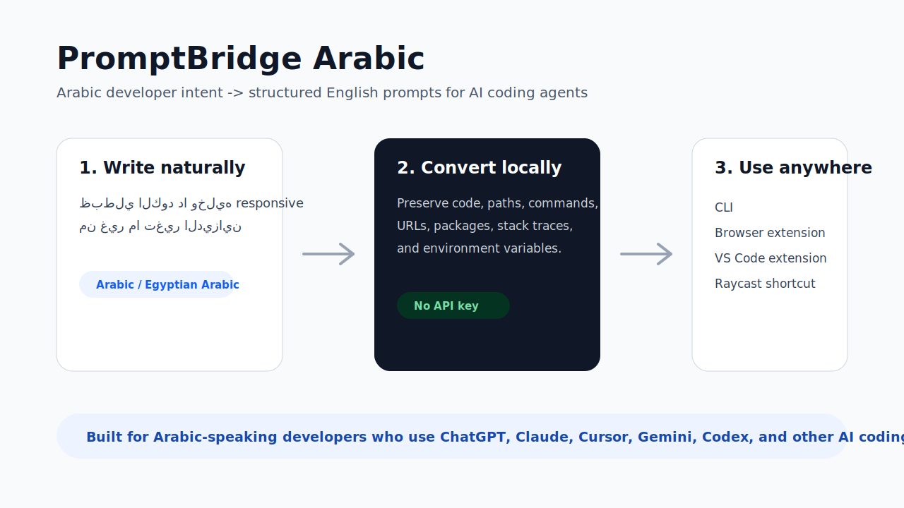
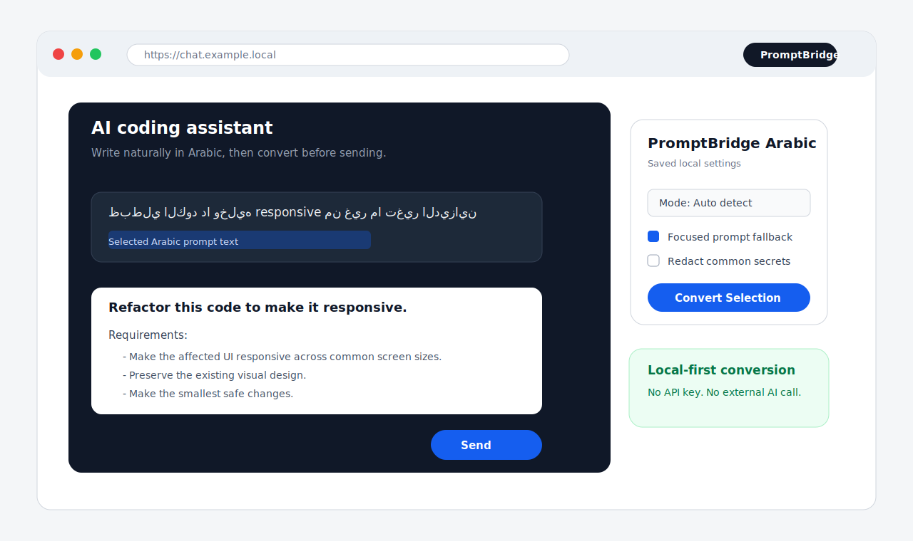
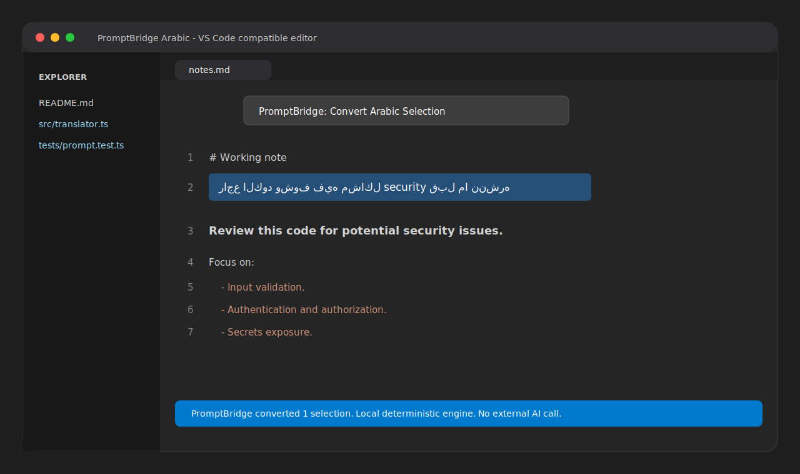
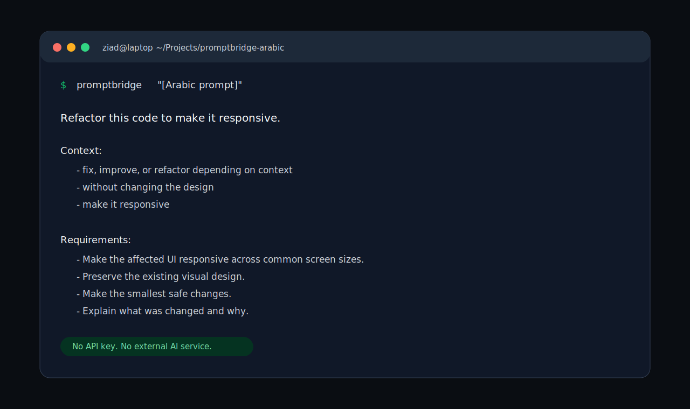

# PromptBridge Arabic

[](https://github.com/ZiadEldesoky/promptbridge-arabic/actions/workflows/ci.yml)
[](https://github.com/ZiadEldesoky/promptbridge-arabic/releases)
[](LICENSE)

Arabic-first prompt translator and optimizer for AI coding agents.

PromptBridge Arabic lets Arabic-speaking developers write coding prompts in Arabic or Egyptian Arabic, then converts them into structured English prompts that work well with ChatGPT, Codex, Claude Code, Cursor, Gemini CLI, and other AI developer tools.



The current MVP is intentionally local and deterministic:

- No API key required.
- No AI translation yet.
- CLI-first core with clipboard automation, selected-text replacement, browser extension, IDE extension, Raycast helper, and experimental macOS menu bar workflows.
- Built around a reusable TypeScript core that future integrations can share.

## Why this exists

Arabic-speaking developers often describe bugs, UI constraints, and product behavior more naturally in Arabic or Egyptian Arabic. Most coding agents respond better to precise structured English. PromptBridge Arabic bridges that gap while preserving technical tokens such as code, paths, commands, package names, stack traces, URLs, and environment variables.

## Platform Support / دعم الأنظمة

PromptBridge is useful beyond macOS, but each workflow has different OS limits.

PromptBridge مش معمول للماك بس، لكن كل workflow ليه حدود حسب النظام:

| Workflow | macOS | Windows | Linux |
| --- | --- | --- | --- |
| CLI | Supported | Supported | Supported |
| Clipboard watch | Supported | Supported | Supported |
| Browser extension | Supported in Chrome-based browsers | Supported in Chrome-based browsers | Supported in Chrome-based browsers |
| VS Code-compatible editor selection | Supported | Supported | Supported |
| VS Code-compatible focused chat input replacement | Supported | Experimental | Experimental |
| CLI selected-text replacement | Supported | Experimental | Experimental |
| Native menu bar / tray helper | Experimental macOS menu bar app | Planned native tray helper | Planned native tray helper |

The macOS menu bar helper is macOS-only because it uses Apple's AppKit and Accessibility APIs. Windows and Linux now have selected-text replacement through CLI/IDE copy-paste automation, while native tray helpers remain future work.

أداة الـ menu bar الحالية macOS-only لأنها مبنية على AppKit وAccessibility بتوع Apple. Windows وLinux عندهم دلوقتي selected-text replacement من خلال CLI/IDE automation، والـ native tray helpers لسه future work.

See [Platform Support](docs/PLATFORM_SUPPORT.md) for the full breakdown.

## Screenshots / لقطات الاستخدام

These screenshots show PromptBridge workflows in neutral terminal, browser, and editor environments.

الصور دي بتوضح طريقة الاستخدام في terminal وbrowser وeditor بشكل محايد، من غير ربط الأداة بواجهة AI واحدة.

### Browser extension / إضافة المتصفح



### IDE extension / إضافة محرر الأكواد



### macOS menu bar / أداة شريط macOS

Experimental helper for lower-friction selected prompt replacement from the macOS menu bar.

أداة تجريبية في شريط macOS لتقليل الخطوات: فعّلها، حدد جزء عربي، وهي تحاول تبدله بالإنجليزي.

### CLI / التيرمنال



## Quick Start / التشغيل السريع

PromptBridge can be used in different ways depending on where you write prompts.

PromptBridge تقدر تستخدمه بأكتر من طريقة حسب المكان اللي بتكتب فيه الـ prompts.

### Browser users / مستخدمي المتصفح

Use this if you write prompts in ChatGPT, Claude, Gemini, Cursor web tools, or any browser-based AI app.

استخدم الطريقة دي لو بتكتب prompts جوه ChatGPT أو Claude أو Gemini أو أي AI app في المتصفح.

1. Download the latest browser extension zip from [GitHub Releases](https://github.com/ZiadEldesoky/promptbridge-arabic/releases).
2. Unzip the file.
3. Open `chrome://extensions`.
4. Enable Developer mode.
5. Click **Load unpacked** and select the unzipped folder.

لو عامل clone للريبو، تقدر تحمل الامتداد مباشرة من غير build:

```text
extensions/browser
```

Workflow / طريقة الاستخدام:

1. Write Arabic in the AI prompt box.
2. Select the Arabic text, or keep the prompt box focused.
3. Use right click -> **Convert Arabic prompt with saved settings**, the extension popup, or `Command+Shift+Y` on macOS.
4. PromptBridge replaces it with a structured English coding-agent prompt.

### CLI users / مستخدمي التيرمنال

Use this if you work from terminal or CLI coding agents.

استخدم الطريقة دي لو بتشتغل من التيرمنال أو مع CLI coding agents.

```bash
npm install
npm run build
npm link
```

Then run / وبعدها شغل:

```bash
promptbridge "ظبطلي الكود دا وخليه responsive من غير ما تغير الديزاين"
```

For development without linking / للتجربة أثناء التطوير:

```bash
npm run dev -- "ظبطلي الكود دا وخليه responsive من غير ما تغير الديزاين"
```

### IDE users / مستخدمي VS Code و Cursor

Use this if you want PromptBridge inside VS Code-compatible editors.

استخدم الطريقة دي لو عايز PromptBridge جوه VS Code أو editors متوافقة مع VS Code extensions.

Build a local VSIX:

```bash
npm run release:vscode
```

Install in VS Code:

```bash
code --install-extension artifacts/promptbridge-arabic-vscode-v0.11.6.vsix
```

Available commands / الأوامر المتاحة:

- `PromptBridge: Convert Arabic Selection`
- `PromptBridge: Replace Selected Text in Focused Input`
- `PromptBridge: Convert Arabic Prompt to Clipboard`
- `PromptBridge: Insert Converted Arabic Prompt`

Quick selection workflow / أسرع workflow للتحديد:

1. Select Arabic text inside a real editor document.
2. Press `Cmd+Shift+Y` on macOS or `Ctrl+Shift+Y` on Windows/Linux, or right-click and choose **PromptBridge: Convert Arabic Selection**.

For IDE chat inputs such as Antigravity's prompt box, select the Arabic text and press `Cmd+Shift+Y` on macOS or `Ctrl+Shift+Y` on Windows/Linux. PromptBridge will copy the selected text, convert it, and paste the English prompt back over the same selection when platform input automation is available.

لو بتكتب في chat input جوه Antigravity أو Cursor، حدد النص العربي واضغط `Cmd+Shift+Y` على macOS أو `Ctrl+Shift+Y` على Windows/Linux. الأداة هتعمل copy للنص المحدد، تحوله، وتعمل paste للإنجليزي مكان نفس التحديد لو input automation متاح على النظام.

If the editor was already open during installation, run **Developer: Reload Window** once.

لو الـ editor كان مفتوح أثناء التثبيت، اعمل **Developer: Reload Window** مرة واحدة.

Cursor and other VS Code-compatible editors may support installing the generated `.vsix` manually.

Cursor وأي editor متوافق مع VS Code ممكن يدعم تثبيت ملف `.vsix` يدويًا حسب نسخة الـ editor.

### macOS menu bar users / مستخدمي شريط macOS

Use this if you want a top-bar helper that can replace selected Arabic text while it is enabled.

استخدم دي لو عايز أداة في top bar تقدر تبدل النص العربي المحدد وهي مفعلة.

```bash
npm run release:macos
open artifacts/PromptBridgeArabicMenuBar.app
```

Before using it, make sure Node.js is available and build the project locally:

قبل استخدامها، تأكد إن Node.js متاح وابني المشروع محليًا:

```bash
npm install
npm run build
```

Workflow / طريقة الاستخدام:

1. Open the app and click the PromptBridge text-bubble icon in the macOS menu bar.
2. Enable **Auto Replace Selected Arabic**.
3. Give the app Accessibility permission when macOS asks.
4. Select Arabic text in an AI prompt box. PromptBridge converts only the selected part and pastes the English prompt back over it.

This helper is experimental because macOS apps expose selected text differently. It tries Accessibility first, then falls back to local copy/paste.

الأداة دي experimental لأن كل تطبيق على macOS بيتعامل مع selected text بطريقة مختلفة. هي بتحاول Accessibility الأول، وبعدها fallback بـ copy/paste محلي.

For the most stable Accessibility permission, copy the app to `/Applications/PromptBridgeArabicMenuBar.app` and keep that same app name between releases.

عشان صلاحية Accessibility تفضل ثابتة، انقل التطبيق إلى `/Applications/PromptBridgeArabicMenuBar.app` وخلي نفس اسم التطبيق مع كل إصدار.

### Desktop shortcut users / مستخدمي اختصارات سطح المكتب

Use this if you want selected Arabic text in any desktop app to be replaced in place.

استخدم الطريقة دي لو عايز تحدد نص عربي في أي desktop app ويتبدل مكانه بالـ prompt الإنجليزي.

```bash
promptbridge replace-selection --redact
```

You can run it from Raycast, AutoHotkey, or a Linux desktop shortcut using the helpers in:

تقدر تشغله من Raycast أو AutoHotkey أو Linux desktop shortcut باستخدام الملفات الموجودة في:

```text
extensions/raycast
extensions/windows
extensions/linux
```

Platform notes:

- macOS requires Accessibility permission for the app that runs the command.
- Windows uses PowerShell input automation.
- Linux requires `xdotool` on X11 or `wtype` on Wayland.

ملاحظات حسب النظام:

- macOS هيطلب Accessibility permission للتطبيق اللي بيشغل الأمر، مثل Raycast أو Terminal.
- Windows بيستخدم PowerShell input automation.
- Linux محتاج `xdotool` على X11 أو `wtype` على Wayland.

## Install Locally / التثبيت المحلي

```bash
npm install
npm run build
npm link
```

Then run:

```bash
promptbridge "ظبطلي الكود دا وخليه responsive من غير ما تغير الديزاين"
```

For development without linking:

```bash
npm run dev -- "ظبطلي الكود دا وخليه responsive من غير ما تغير الديزاين"
```

## CLI examples

```bash
promptbridge "ظبطلي الكود دا وخليه responsive من غير ما تغير الديزاين"
```

```bash
promptbridge "شوف المشكلة دي وصلحها" --mode fix
```

```bash
promptbridge "راجع الكود وشوف فيه مشاكل security" --mode security --copy
```

```bash
promptbridge "اشرحلي الكود دا ببساطة" --mode explain --bilingual
```

```bash
promptbridge "هاي"
```

```bash
promptbridge "عايز أزود تقرير مبيعات للعميل" --mode general
```

```bash
promptbridge "استخدم sk-... في src/api.ts" --redact
```

## Clipboard automation

If you do not want to type `promptbridge` before every prompt, run clipboard watch mode:

```bash
promptbridge watch --redact
```

Then use this workflow in any app:

1. Write your prompt in Arabic.
2. Copy it.
3. PromptBridge replaces the clipboard with the English coding-agent prompt.
4. Paste it into Codex, Cursor, Claude, Gemini, ChatGPT, or any other AI tool.

For a one-shot conversion suitable for a global shortcut or Raycast command:

```bash
promptbridge watch --once --redact
```

For replacing selected text in desktop apps:

```bash
promptbridge replace-selection --redact
```

Workflow:

1. Select Arabic text inside any app.
2. Run `promptbridge replace-selection --redact` from a global shortcut, Raycast script command, or terminal.
3. The command copies the selected text, converts it, then pastes the English prompt back into the active app.

Platform requirements:

- macOS: Accessibility permission for the app that runs the command, such as Terminal, iTerm, Raycast, or Automator.
- Windows: PowerShell input automation available in the current user session.
- Linux: `xdotool` for X11 or `wtype` for Wayland.

## GUI workflows

PromptBridge now includes early GUI helpers for people who write prompts inside browser or desktop AI apps.

### Browser extension

The browser extension converts selected Arabic prompt text in editable web fields, including common AI chat prompt boxes.

For normal users, no build is required.

Download the browser extension zip from GitHub Releases, unzip it, then load the unzipped folder from `chrome://extensions` with Developer mode enabled.

If you cloned the repository, you can also load this folder directly:

```text
extensions/browser
```

For maintainers who want to rebuild the extension:

```bash
npm run build:browser
```

To create a release-ready zip:

```bash
npm run release:browser
```

Workflow:

1. Write Arabic text inside a web AI prompt box.
2. Select the Arabic text, or leave the prompt box focused if focused-field fallback is enabled.
3. Use right click -> **Convert Arabic prompt with saved settings**, the extension popup, or `Command+Shift+Y` on macOS.
4. PromptBridge replaces the selected text or focused prompt box with the structured English prompt.

The extension uses the local deterministic core and does not call external AI services. The popup saves browser-local defaults for mode, bilingual output, redaction, and focused-field fallback. Redaction is only applied when selected or saved as a default.

Publishing notes for maintainers are in [Chrome Web Store](docs/publishing/CHROME_WEB_STORE.md), [IDE Extensions](docs/publishing/IDE_EXTENSIONS.md), and [Privacy](docs/PRIVACY.md).

### Raycast helper

For macOS GUI apps, use the Raycast script command in `extensions/raycast`.

```bash
promptbridge replace-selection --redact
```

Raycast runs the same command behind a shortcut, so the workflow is: select Arabic text -> trigger Raycast command -> paste-ready English prompt replaces the selection.

### IDE extension

PromptBridge includes a VS Code-compatible extension under `extensions/vscode`.

Build and package a local VSIX:

```bash
npm run release:vscode
```

Install in VS Code:

```bash
code --install-extension artifacts/promptbridge-arabic-vscode-v0.11.6.vsix
```

The extension adds commands for converting selected Arabic text, replacing selected text in focused IDE inputs, converting an input prompt to the clipboard, and inserting a converted prompt into the active editor. It also adds `Cmd+Shift+Y` on macOS / `Ctrl+Shift+Y` on Windows and Linux for selected editor text and focused prompt inputs, plus an editor right-click menu item. It is intended for VS Code and VS Code-compatible editors that support VSIX installation.

### macOS menu bar helper

PromptBridge includes an experimental native macOS helper under `extensions/macos`.

```bash
npm run release:macos
open artifacts/PromptBridgeArabicMenuBar.app
```

The helper adds a PromptBridge text-bubble icon to the macOS menu bar. When **Auto Replace Selected Arabic** is enabled, it watches selection changes, converts the selected Arabic text through a bundled deterministic converter, and replaces only that selected text. It requires Accessibility permission and Node.js in the user's login shell.

## CLI agent wrappers

For CLI coding agents, you can set up shell wrappers once and then write Arabic directly in the normal agent command:

```bash
source examples/shell/promptbridge-agents.zsh
codex "ظبطلي الكود دا وخليه responsive"
```

The wrapper runs PromptBridge before the real agent command, converts Arabic prompt arguments to English, then passes the English prompt to the agent.

Direct usage:

```bash
promptbridge run codex "ظبطلي الكود دا وخليه responsive"
promptbridge run claude "راجع الكود وشوف فيه مشاكل security"
promptbridge run gemini "اشرحلي الكود دا ببساطة"
```

This is intentionally app-agnostic. Direct conversion while typing with no selection or shortcut still requires a future OS-level input method or app-specific integration.

## Options

```text
--mode <mode>   Choose one of: general, fix, refactor, review, tests, explain, security
--config <path> Load a custom PromptBridge config file
--copy          Copy the generated prompt to the clipboard
--bilingual     Include an Arabic summary after the English prompt
--redact        Redact common secrets before generating the prompt
```

## Config files

PromptBridge can load optional JSON config from:

```text
.promptbridge.json
promptbridge.config.json
~/.promptbridge/config.json
```

You can also pass an explicit file:

```bash
promptbridge "راجع الصلاحيات" --config ./promptbridge.config.json
```

Example config:

```json
{
  "defaultMode": "fix",
  "defaultOutput": "english",
  "preserveArabicUIText": true,
  "redactSecrets": true,
  "agent": "codex",
  "style": "structured",
  "glossaryPath": "./promptbridge.glossary.json"
}
```

Custom glossary files can be arrays:

```json
[
  {
    "arabic": "راجع الصلاحيات",
    "english": "review authorization rules",
    "tags": ["security"]
  }
]
```

Or simple objects:

```json
{
  "راجع الصلاحيات": "review authorization rules"
}
```

## Example output

Input:

```text
ظبطلي الكود دا وخليه responsive من غير ما تغير الديزاين
```

Output:

```text
Refactor this code to make it responsive.

Requirements:
- Make the affected UI responsive across common screen sizes.
- Preserve the existing behavior.
- Avoid changing public APIs unless necessary.
- Make the smallest safe changes.
- Explain what was changed and why.
- Preserve the existing visual design.

Constraints:
- Do not redesign the UI.

Expected output:
- A concise summary of what changed and what was verified.
```

## Architecture

```text
src/
  agents/
    runAgent.ts
  cli.ts
  index.ts
  translator/
    translatePrompt.ts
    modes.ts
    glossary.ts
    preserveTechnicalTokens.ts
  redaction/
    redactSecrets.ts
    patterns.ts
  formatting/
    formatOutput.ts
  clipboard/
    copyToClipboard.ts
    replaceSelection.ts
    watchClipboard.ts
  config/
    loadConfig.ts
    types.ts
tests/
  translatePrompt.test.ts
  redactSecrets.test.ts
  preserveTechnicalTokens.test.ts
  loadConfig.test.ts
  replaceSelection.test.ts
  runAgent.test.ts
  watchClipboard.test.ts
  guiIntegrations.test.ts
docs/
  assets/
    screenshots/
      browser-extension.svg
      terminal-demo.svg
      vscode-extension.svg
      workflow-overview.svg
extensions/
  browser/
    src/
      settings.ts
      siteAdapters.ts
  raycast/
  vscode/
    src/
      extension.ts
scripts/
  build-browser-extension.mjs
  package-browser-extension.mjs
  build-vscode-extension.mjs
  package-vscode-extension.mjs
```

The core flow is:

1. Optionally redact secrets.
2. Preserve technical tokens such as code blocks, file paths, commands, URLs, package names, stack traces, and environment variables.
3. Detect prompt intent and glossary signals.
4. Apply a deterministic mode template.
5. Format an agent-ready English prompt.
6. Optionally include a bilingual Arabic summary.
7. Optionally copy the result to the clipboard.
8. Optionally load defaults and custom glossary entries from config.
9. Optionally wrap CLI agent commands and convert Arabic arguments before execution.
10. Optionally reuse the core engine from GUI integrations such as the browser extension.

## Development

```bash
npm install
npm test
npm run typecheck
npm run typecheck:browser
npm run build
npm run build:browser
npm run package:browser
npm run typecheck:vscode
npm run build:vscode
npm run package:vscode
npm run release:browser
npm run release:vscode
```

## Project health

- Tests: Vitest coverage for translation modes, glossary matching, config loading, token preservation, and redaction.
- CI: GitHub Actions runs install, tests, Node typecheck, browser extension typecheck, VS Code extension typecheck, CLI build, browser extension build, and extension packaging on every push and pull request.
- Security: optional redaction is local-only and does not send prompts to external services.
- Privacy: see [docs/PRIVACY.md](docs/PRIVACY.md) for the browser and IDE extension privacy policy.
- Maintenance: see [CONTRIBUTING.md](CONTRIBUTING.md), [SECURITY.md](SECURITY.md), and [CHANGELOG.md](CHANGELOG.md).

## Current modes

- `general`
- `fix`
- `refactor`
- `review`
- `tests`
- `explain`
- `security`

## Current limitations

- Translation is deterministic and template-based, so it prioritizes developer, business, product, and friendly prompt wording over full free-form translation.
- The glossary is intentionally small, but now includes common friendly phrases and business/product terms.
- Replacing selected text inside browser prompt boxes and normal editor documents is cross-platform.
- Replacing selected text in arbitrary desktop apps is supported through CLI copy/paste automation on macOS and experimental on Windows/Linux.
- The browser extension currently works through selected text or the focused editable prompt field.
- The IDE extension can replace selected text inside real editor documents. It can also replace selected text inside focused IDE chat inputs using system copy/paste automation on macOS, Windows, and Linux when the platform allows it.
- The macOS menu bar helper is experimental and can only auto-replace text that the focused app exposes through Accessibility or normal copy/paste.
- Automatic replacement while typing without selecting text needs a future OS-level input method or deeper app-specific integration.

## Roadmap

Near-term improvements:

- Publish the browser extension to the Chrome Web Store.
- Publish the IDE extension to VS Code Marketplace and Open VSX.
- Stabilize the macOS menu bar helper and add app-specific adapters for tricky prompt boxes.
- Add a native input-method workflow for true conversion while typing.
- Add first-class wrappers for more CLI agents and GUI launchers.
- Add more Arabic dialect examples.
- Add interactive stdin mode.

## License

MIT
